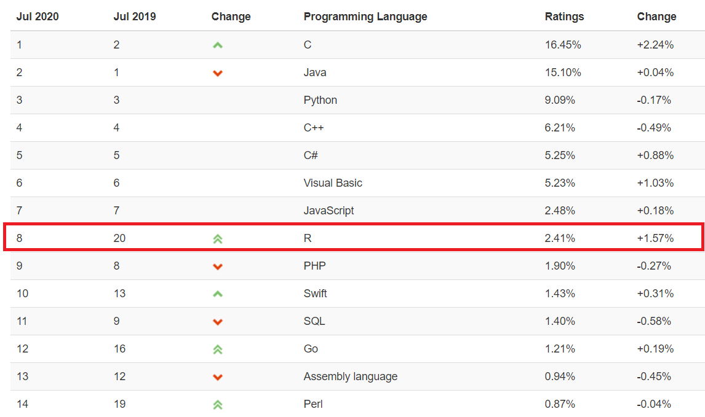
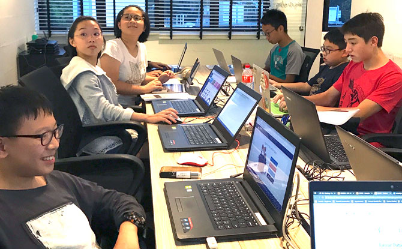
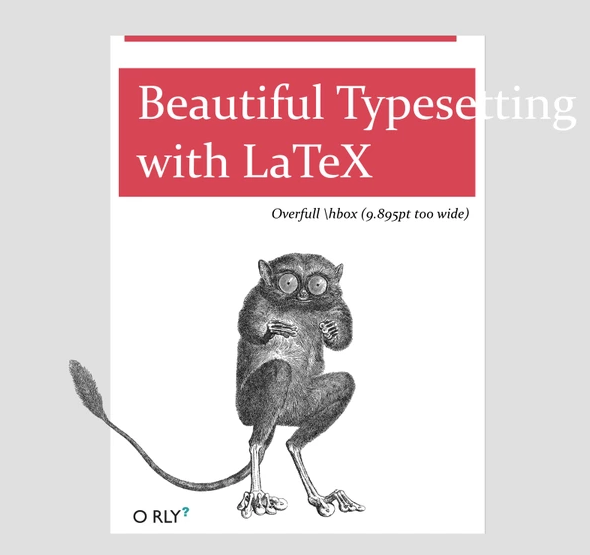

```{r setup, include=FALSE}
options(digits = 3)
knitr::opts_chunk$set(
  comment = "#>",
  echo = TRUE,
  collapse = TRUE,
  message = FALSE,
  warning = FALSE,
  out.width = "50%",
  fig.align = "center",
  fig.asp = 0.618, # 1 / phi
  fig.show = "hold"
)
```

## R能给我们生活带来什么？

这个问题，好比人生三大终极问题：

-   R是什么?
-   R能干什么?
-   为什么是R？

# R是什么

## R那些事

-   1992年，新西兰奥克兰大学统计学教授 Ross Ihaka 和 Robert Gentleman，为了方便地给学生教授统计学课程，他们设计开发了R语言（他们名字的首字母都是R）。

```{r echo=FALSE, out.width = '0.8\\textwidth'}
knitr::include_graphics(path = "images/R_inventor.png")
```

-   2000年，R1.0.0 发布
-   2004年，第一届国际useR!会议（随后每年举办一次）
-   2005年，ggplot2宏包（2018.8 - 2019.8下载量超过 1.3 亿次）
-   2012年，R2.15.2 发布
-   2013年，R3.0.2 发布, CRAN上的宏包数量5026个
-   2016年，Rstudio公司推出 tidyverse 宏包（数据科学当前最流行的R宏包）
-   2017年，R3.4.1 发布，CRAN上的宏包数量10875个
-   2019年，R3.6.1 发布，CRAN上的宏包数量15102个
-   2020年，R4.0.0 发布，CRAN上的宏包数量16054个

[The History of R](https://blog.revolutionanalytics.com/2020/07/the-history-of-r-updated-for-2020.html)

## R是什么

官网定义：<https://www.r-project.org/>

```{r eval=FALSE, include=FALSE}
knitr::include_graphics("images/what_is_R.png")
```

R语言是用于统计分析，图形表示和报告的编程语言:

-   R 是一个\textcolor{red}{统计编程}语言（statistical programming）
-   R 可运行于多种平台之上，包括Windows、UNIX 和 Mac OS X
-   R 拥有顶尖水准的\textcolor{red}{制图}功能
-   R 是免费的
-   R 应用广泛，拥有丰富的\textcolor{red}{库包}
-   活跃的\textcolor{red}{社区}

<!-- -   R 是一个**统计编程**语言（statistical programming） -->
<!-- -   R 可运行于多种平台之上，包括Windows、UNIX 和 Mac OS X -->
<!-- -   R 拥有顶尖水准的**制图**功能 -->
<!-- -   R 是免费的 -->
<!-- -   R 应用广泛，拥有丰富的**库包** -->
<!-- -   活跃的**社区** -->

## R语言发展趋势

```{r echo=FALSE, out.width = '100%'}

```

[TIOBE index](https://www.tiobe.com/tiobe-index/)

## 界面很友好

```{r out.width = '85%', echo = FALSE}
knitr::include_graphics("images/rstudio-editor.png")
```

## R路上的大神

2019 年 8 月，国际统计学年会将考普斯总统奖（\textcolor{red}{被誉为统计学的诺贝尔奖}）奖颁给 tidyverse 的作者

```{r echo=FALSE, out.width = '50%'}
knitr::include_graphics("images/hadley-wickham.jpg")
```

-   [Hadley Wickham](http://hadley.nz/)
-   R路上的大神
-   一个改变了R语言的人

# R能干什么

## 数据科学的流程

Hadley Wickham 定义了数据科学的工作流程

```{r echo=FALSE, out.width = '\\textwidth'}
knitr::include_graphics(path = "images/data-science-explore.png")
```


## tidyverse套餐

```{r out.width = '80%', echo = FALSE}
knitr::include_graphics("images/tidyverse.png")
```
\centering{https://www.tidyverse.org/}


##  R & tidyverse 

| 序号 	| 内容         	| 代码演示         	|
|------	|--------------	|------------------	|
| 1    	| 统计         	| 1_stats.R        	|
| 2    	| 可视化       	| 2_visual.R       	|
| 3    	| 探索性分析   	| 3_eda.R          	|
| 4    	| 可重复性报告 	| 4_reproducible.R 	|


## 难吗？
\Huge
\centering{ 感觉很难吗？ \\ 如果是，那说明你认真听了}


## 看了这些代码，可能第一眼感觉是这样的
```{r echo=FALSE, out.width = '100%', fig.cap='图片来自电影《降临》'}
knitr::include_graphics("images/arrival-movie.png")
```


## 但我更希望这门课结束后
```{r echo=FALSE, out.width = '100%', fig.cap='图片来自美剧《权利的游戏》'}
knitr::include_graphics("images/night_king.jpg")
```


# 为什么是R


## 社会科学需要统计

```{r echo=FALSE, out.width = '60%'}
knitr::include_graphics("images/social_science.jpg")
```

\centering{我们不是学统计的，但需要统计}


## 社会科学需要可视化

```{r echo=FALSE, out.width = '50%'}

```


\centering{我们不是学美术的，但要可视化}


## 社会科学需要编程

```{r echo=FALSE, out.width = '80%'}

```

\centering{我们不是学计算机的，但需要编程}


## 你的论文需要排版

```{r echo=FALSE, out.width = '60%'}

```

\centering{我们不是学设计的，但要操心\textcolor{red}{交叉引用}的事}


## 挖掘机技术到底哪家强？

<!-- \centering{  -->
<!-- \Large{\textcolor{red}{你有需求，而我很专业}} -->
<!-- } -->

\centering
你有需求，而
\raisebox{-.5\height}{\includegraphics[height=3\baselineskip]{images/R_logo.png}}
很专业


| 序号 	| 内容          	| 特性     	| 评价 	| 
|------	|---------------	|----------	|------	|
| 1    	| 统计分析      	| 看家本领 	| 好用 	|
| 2    	| ggplot2画图   	| 颜值担当 	| 好看 	| 
| 3    	| tidyverse语法 	| 简单易懂 	| 好学 	| 
| 4    	| 可重复性报告  	| 方便快捷 	| 好玩 	| 


## 一见钟情，还是相见恨晚？

```{r echo=FALSE, out.width = '100%'}
knitr::include_graphics("images/R_vs_SPSS.jpg")
```


# 关于学习

## 我们的课程不会枯燥

```{r echo=FALSE, out.width = '45%'}
knitr::include_graphics("images/data_science.png")
```

- 数据科学是为社会科学服务的，我们会有很多案例
- 编程是工具，统计是灵魂，专业是核心


## 关于学习

我很少使用

$$
f(x)=\frac{1}{\sqrt{2 \pi}} e^{-\frac{1}{2} x^{2}}
$$

更多的是

```{r, eval = FALSE}
library(tidyverse)
summary_monthly_temp <- weather %>% 
  group_by(month) %>% 
  summarize(mean = mean(temp), 
            std_dev = sd(temp))
```

## 关于学习

### 课程目标

-   训练数据思维，提升编程技能，培养创新能力

### 学习方法

-   **问题驱动型学习**
-   多实践（光看李小龙的电影，是学不会功夫的）
-   不是 learning R，而是 learning with R 
-   把 R 看做是知识学习的**脚手架**

```{r echo=FALSE, out.width = '35%'}

```


<!-- ## 内容 -->

<!-- \tiny -->
<!-- ```{r, echo= FALSE, message=FALSE, warning=FALSE} -->
<!-- library(tidyverse) -->
<!-- library(readxl) -->
<!-- d <- readxl::read_excel("content/contents.xlsx") -->
<!-- d %>%  -->
<!--   select(1:3) %>%  -->
<!--   knitr::kable() %>%  -->
<!--   kableExtra::kable_styling(latex_options = "striped", font_size = 5) %>% -->
<!--   kableExtra::column_spec(3, width = "5cm") -->
<!-- ``` -->


## 参考书目

```{r echo=FALSE, out.width = '35%'}
knitr::include_graphics("images/r4ds-cover.png")
```

- [R for Data Science](https://r4ds.had.co.nz/)
- [https://bookdown.org/wangminjie/R4DS/](https://bookdown.org/wangminjie/R4DS/)
