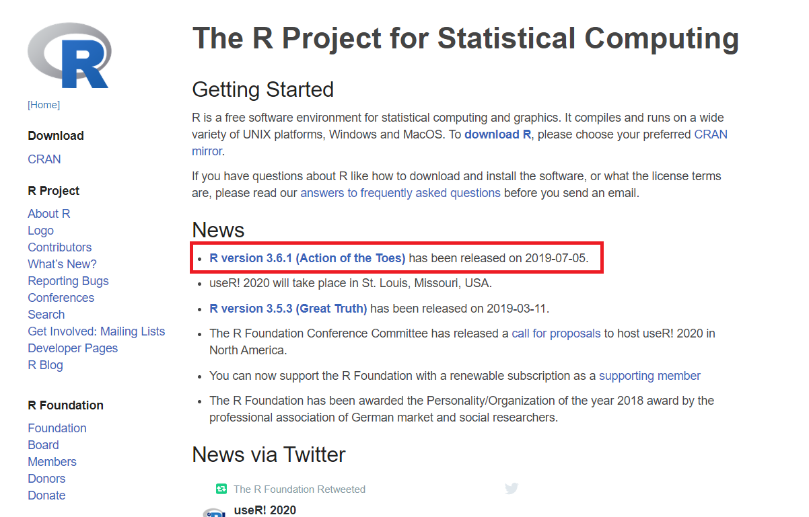
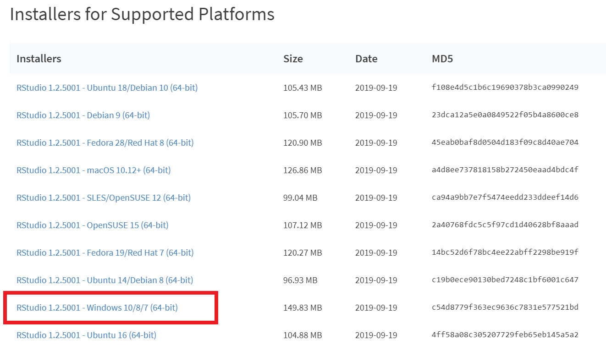

```{r setup, include=FALSE}
options(digits = 3)
knitr::opts_chunk$set(
  comment = "#>",
  echo = TRUE,
  collapse = TRUE,
  message = FALSE,
  warning = FALSE,
  out.width = "50%",
  fig.align = "center",
  fig.asp = 0.618, # 1 / phi
  fig.show = "hold"
)
```

# 配置R语言环境

## 准备工作

- \textcolor{red}{第一步}：连网（无线）办法 
  - 用户名：学号+ @sicnu，比如 `20150956@sicnu`
  - 密码：出生年月日 + 身份证最后一位(如果最后一位为X，要大写)，比如 `19880923X`
   
- \textcolor{red}{第二步}：加QQ群 877502037

```{r echo=FALSE, out.width = '25%'}
knitr::include_graphics(path = "images/PsyStatQQgroup.png")
```

- \textcolor{red}{第三步}：在QQ群文件里下载(R-4.0.2-win.exe, RStudio-1.3.1091.exe)，点击安装


## 环境配置

主要分三步：

-   安装R
-   安装Rstudio
-   安装必要的宏包(packages)

## 第一步安装R

-   下载并安装R，官方网站<http://cran.r-project.org>

```{r echo=FALSE, out.width = '85%'}

```

## 第二步安装RStudio

-   下载并安装RStudio，官方网站 <https://www.rstudio.com/download>
-   选择`RStudio Desktop`

```{r out.width = '85%', echo = FALSE}

```

## 注意事项

这里有个小小的提示：

-   电脑用户名\textcolor{red}{不要有中文和空格}

-   尽量安装在\textcolor{red}{非系统盘}，比如，可以选择安装在D盘

-   安装路径\textcolor{red}{不要有中文和空格}。比如，这样就比较好

    -   `D:/R`
    -   `D:/Rstudio`

## RStudio很友好

```{r out.width = '85%', echo = FALSE}
knitr::include_graphics("images/rstudio-editor1.png")
```

## R 与 RStudio 是什么关系呢

\qquad \qquad \qquad R \hspace{4cm} RStudio

```{r out.width = '45%', echo = FALSE}
knitr::include_graphics(c("images/engine.jpg", "images/dashboard.jpg"))
```

\centering{R 是有趣的灵魂，Rstudio 是好看的皮囊}


## 第三步安装宏包

```{r out.width = '65%', echo = FALSE}
knitr::include_graphics("images/RStudio-Screenshot.png")
```

-   命令行安装

    - `install.packages("tidyverse")`

<!-- ## \LaTeX (不是必须的) -->

<!-- 如果想生成pdf文档，可能需要\LaTeX，然而，这个软件会比较大，动辄4个G. 因此，我推荐安装轻量级的 `tinytex`. 安装方法如下， -->

<!-- -   `install.packages("tinytex")` -->
<!-- -   `tinytex::install_tinytex(dir = "D:\\Tinytex", force = T)` -->

<!-- \vfill -->

<!-- 中途会有两次警告，按"确定"就可以了 -->

<!-- ## 获取帮助很便捷 -->

<!-- ```{r out.width = '100%', echo = FALSE} -->
<!-- knitr::include_graphics("images/Rhelp.png") -->
<!-- ``` -->

## 测试

复制以下代码到脚本编辑区 \small

```{r, eval=FALSE}
library(ggplot2)

ggplot(midwest, aes(x = area, y = poptotal)) +
  geom_point(aes(color = state, size = popdensity)) +
  geom_smooth(method = "loess", se = F) +
  xlim(c(0, 0.1)) +
  ylim(c(0, 500000)) +
  labs(
    title = "Scatterplot",
    subtitle = "Area Vs Population",
    x = "Area",
    y = "Population"
  )
```

## 测试

```{r out.width = '100%', echo = FALSE}
library(ggplot2)

ggplot(midwest, aes(x = area, y = poptotal)) +
  geom_point(aes(color = state, size = popdensity)) +
  geom_smooth(method = "loess", se = F) +
  xlim(c(0, 0.1)) +
  ylim(c(0, 500000)) +
  labs(
    title = "Scatterplot",
    subtitle = "Area Vs Population",
    x = "Area",
    y = "Population"
  )
```

# 可能的问题

## 可能的问题

-   我的电脑是苹果系统，怎么安装呢？

-   我的Rstudio需要哪些设置？

-   为什么Rstudio打开是空白呢？

-   安装宏包太慢，怎么解决？

-   安装宏包，遇到报错信息"unable to access index for repository..."？
