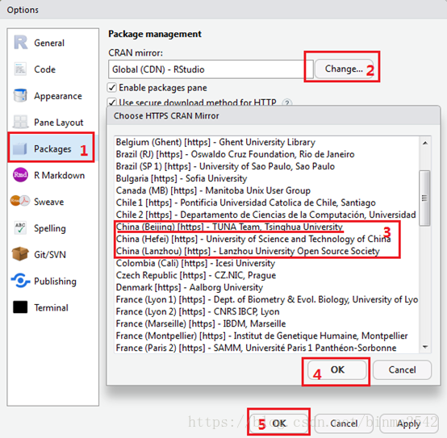

```{r setup, include=FALSE}
options(digits = 3)
knitr::opts_chunk$set(
  comment = "#>",
  echo = TRUE,
  collapse = TRUE,
  message = FALSE,
  warning = FALSE,
  out.width = "50%",
  fig.align = "center",
  fig.asp = 0.618, # 1 / phi
  fig.show = "hold"
)
```

# 配置R语言环境

## 准备工作

- \textcolor{red}{第一步}：连网（无线）办法 
  - 用户名：学号+ @sicnu，比如 `20150956@sicnu`
  - 密码：出生年月日 + 身份证最后一位(如果最后一位为X，要大写)，比如 `19880923X`
   
- \textcolor{red}{第二步}：加QQ群 

```{r echo=FALSE, out.width = '25%'}
#knitr::include_graphics(path = "images/QQgroup_PsyStats.png")
knitr::include_graphics(path = "images/QQgroup_shizishan.png")
knitr::include_graphics(path = "images/QQgroup_chenglong.png")
```

- \textcolor{red}{第三步}：在QQ群文件里下载(R-4.0.2-win.exe, RStudio-1.3.1091.exe)，点击安装


## 环境配置

主要分三步：

-   安装R
-   安装Rstudio
-   安装必要的宏包(packages)

## 第一步安装R

-   下载并安装R，官方网站<http://cran.r-project.org>

```{r echo=FALSE, out.width = '85%'}
knitr::include_graphics("images/Rinstall.png")
```

## 第二步安装RStudio

-   下载并安装RStudio，官方网站 <https://www.rstudio.com/download>
-   选择`RStudio Desktop`

```{r out.width = '85%', echo = FALSE}
knitr::include_graphics("images/Rstudio_install.png")
```

## 注意事项

这里有个小小的提示：

-   电脑用户名\textcolor{red}{不要有中文和空格}

-   尽量安装在\textcolor{red}{非系统盘}，比如，可以选择安装在D盘

-   安装路径\textcolor{red}{不要有中文和空格}。比如，这样就比较好

    -   `D:/R`
    -   `D:/Rstudio
    


## R 与 RStudio 是什么关系呢

\qquad \qquad \qquad R \hspace{4cm} RStudio

```{r, fig.show="hold", out.width="49%", echo = FALSE}
knitr::include_graphics(c("images/engine.jpg", "images/dashboard.jpg"))
```

\centering{R 是有趣的灵魂， Rstudio 是好看的皮囊}


## RStudio很友好

从windows开始菜单，点开rstudio，界面效果

```{r out.width = '75%', echo = FALSE}
knitr::include_graphics("images/rstudio-editor1.png")
```


## 第三步安装宏包

```{r out.width = '60%', echo = FALSE}
knitr::include_graphics("images/RStudio-Screenshot.png")
```

-   命令行安装

    - `install.packages("tidyverse")`
    - 回车，安静等待
    
<!-- ## \LaTeX (不是必须的) -->

<!-- 如果想生成pdf文档，可能需要\LaTeX，然而，这个软件会比较大，动辄4个G. 因此，我推荐安装轻量级的 `tinytex`. 安装方法如下， -->

<!-- -   `install.packages("tinytex")` -->
<!-- -   `tinytex::install_tinytex(dir = "D:\\Tinytex", force = T)` -->

<!-- \vfill -->

<!-- 中途会有两次警告，按"确定"就可以了 -->

<!-- ## 获取帮助很便捷 -->

<!-- ```{r out.width = '100%', echo = FALSE} -->
<!-- knitr::include_graphics("images/Rhelp.png") -->
<!-- ``` -->

## 如果宏包安装速度太慢， 方法一

- 指定清华大学镜像

```{r, eval = FALSE}
install.packages(
  "tidyverse",
  repos = "http://mirrors.tuna.tsinghua.edu.cn/CRAN"
)
```


- 或者，指定兰州大学镜像

```{r, eval = FALSE}
install.packages(
  "tidyverse",
  repos = "https://mirror.lzu.edu.cn/CRAN/"
)
```


## 如果宏包安装速度太慢， 方法二

- `Rstudio`里设置镜像，步骤如下：

<!-- {width=49%} {width=49%} -->


```{r image_grobs, fig.show='hold', out.width = "49%", fig.align = "default", echo=FALSE}
library(cowplot)
library(ggplot2)

ggdraw() + draw_image("images/mirror1.png")
ggdraw() + draw_image("images/mirror2.png")
```


- 然后

```{r, eval = FALSE }
install.packages("tidyverse")
```


## 测试

复制以下代码到**脚本编辑区** \footnotesize

```{r, eval=FALSE}
library(ggplot2)

ggplot(midwest, aes(x = area, y = poptotal)) +
  geom_point(aes(color = state, size = popdensity)) +
  geom_smooth(method = "loess", se = F) +
  xlim(c(0, 0.1)) +
  ylim(c(0, 500000)) +
  labs(
    title = "Scatterplot",
    subtitle = "Area Vs Population",
    x = "Area",
    y = "Population"
  )
```


## 运行

```{r out.width = '65%', echo = FALSE}
knitr::include_graphics("images/run_script.png")
```

- 方法1：点击`Run`, 运行光标所在行的代码
- 方法2：点击`Source`，从头到尾运行全部代码


## 如果出现这个图，说明配置成功

```{r out.width = '100%', echo = FALSE}
library(ggplot2)

ggplot(midwest, aes(x = area, y = poptotal)) +
  geom_point(aes(color = state, size = popdensity)) +
  geom_smooth(method = "loess", se = F) +
  xlim(c(0, 0.1)) +
  ylim(c(0, 500000)) +
  labs(
    title = "Scatterplot",
    subtitle = "Area Vs Population",
    x = "Area",
    y = "Population"
  )
```

# 可能的问题

## 可能的问题

- 我的电脑是苹果系统，怎么安装呢？
- 我的Rstudio需要哪些设置？
- 我的系统不能兼容64位的Rstudio？
- 为什么Rstudio打开是空白呢？
- 安装宏包太慢，怎么解决？
- 安装宏包，遇到报错信息"unable to access index for repository..."？


## Happy R

课时有限，想掌握这门技术，需要课后多下功夫

- 请务必配置好环境，包括安装宏包（群里有安装视频，实在不行，@我远程协助）
- 学习资料 https://bookdown.org/wangminjie/R4DS/
- 参考书目《R数据科学》（群文件book文件夹中）
- 我们不是孙悟空，一出生就身怀绝技。No shame in asking help
- 学习曲线会比较陡，但有老司机带路，要有信心。

祝大家happy R ！
