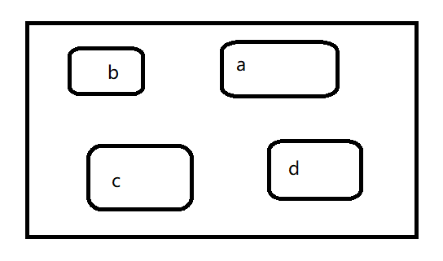

```{r setup, include=FALSE}
options(digits = 3)
knitr::opts_chunk$set(
  comment = "#>",
  echo = TRUE,
  collapse = TRUE,
  message = FALSE,
  warning = FALSE,
  out.width = "100%",
  fig.align = "center",
  fig.asp = 0.618, # 1 / phi
  fig.show = "hold"
)
```


## 子集选取

**对象**就是在计算机里新建了存储空间，好比一个盒子，
我们可以往盒子里装东西，也可以从盒子里取东西。

```{r echo=FALSE, out.width = '85%'}

```


## 数据结构

R 对象的数据结构(向量、矩阵、数组、列表和数据框)

```{r out.width = '100%', echo = FALSE}
knitr::include_graphics("images/data_struction1.png")
```
下面依次讲解，从每一种数据结构中选取子集...


# 开始

## 向量

对于原子型向量，我们有至少四种选取子集的方法
```{r}
x <- c(1.1, 2.2, 3.3, 4.4, 5.5)
```


- 正整数： 指定向量元素中的位置
```{r}
x[1]
```

```{r}
x[c(3,1)]
```
```{r}
x[1:3]
```

## 向量
- 负整数：删除指定位置的元素
```{r}
x[-2]
```


```{r}
x[c(-3, -4)]
```


## 向量

- 逻辑向量：将`TRUE`对应位置的元素提取出来
```{r}
x[c(TRUE, FALSE, TRUE, FALSE, TRUE)]
```

常用的一种情形；筛选出大于某个值的所有元素
```{r}
x > 3
```

```{r}
x[x > 3]
```

## 向量
- 如果是命名向量
```{r}
y <- c("a" =  11, "b" =  12, "c" =  13, "d" =  14)
y
```

我们可以用命名向量，返回对应位置的向量
```{r}
y[c("d", "c", "a")]
```


## 列表

对列表取子集，和向量的方法一样。使用`[`总是返回列表，
```{r}
l <- list("one" = c("a", "b", "c"), 
	        "two" = c(1:5), 
	        "three" = c(TRUE, FALSE)
  )
l
```

```{r}
l[1]   # 仍然是列表喔
```


## 列表

如果想列表中的元素，需要使用`[[`
```{r}
l[[1]]
```


也可以使用其中的元素名，比如`[["one"]]`， 
```{r}
l[["one"]]
```


程序员觉得以上太麻烦了，于是用`$`来简写
```{r}
l$one
```


## 列表

所以，请记住

- `[` 和 `[[` 的区别
- `x$y` 是 `x[["y"]]` 的简写
 
 
 
 
## 矩阵

```{r}
a <- matrix(1:9, nrow = 3, byrow = TRUE)
a
```
我们取第1到第2行的2-3列，写成`[1:2, 2:3]`. 注意，中间以逗号分隔，它得到一个新的矩阵
```{r}
a[1:2, 2:3]
```


## 矩阵
默认情况下, `[` 会将获取的数据以尽可能低的维度形式呈现。比如
```{r}
a[1, 1:2]
```
表示第1行的第1、2列，此时不再是$1 \times 2$矩阵，而是包含了两个元素的向量。

\vfill
**以尽可能低的维度形式呈现**，简单理解就是，这个`r a[1, 1:2]`长的像个矩阵，又有点像向量，向量的维度比矩阵低，那就是向量吧。


## 矩阵
有些时候，我们想保留所有的行或者列，比如

- 行方向，只选取第1行到第2行
- 列方向，选取所有列

可以这样简写

```{r}
a[1:2, ]
```

想想，这种写法，会输出什么
```{r, eval = FALSE}
a[ , ]
```


## 矩阵

```{r}
a[ , ]
```


```{r}
# 可以再简化点？
a[]
```


```{r}
# 是不是可以再简化点？
a
```


## 数据框

数据框具有`list`和`matrix`的双重属性，因此

- 当选取数据框的某几列的时候，可以像list一样，指定元素位置，比如`df[1:2]`选取前两列 
- 也可以像矩阵一样，使用行和列的标识选取，比如`df[1:3, ]`选取前三行的所有列

\small
```{r}
df <- data.frame(x = 1:4,
				 y = 4:1,
				 z = c("a", "b", "c", "d") )
df
```

## 数据框

\small
```{r}
# Like a list
df[c("x", "z")]
```


```{r}
# Like a matrix
df[, c("x", "z")]
```

## 数据框

也可以通过行和列的位置
```{r}
df[1:2]
```


```{r}
df[1:3, ] 
```


## 数据框
遇到单行或单列的时候，也和矩阵一样，数据会降维
```{r}
df[, "x"]
```

如果想避免降维，需要多写一句话

```{r}
df[, "x", drop = FALSE]
```

<!-- 这样输出的还是矩阵形式, 但程序员总是偷懒的，不想多写`drop = FALSE`， -->
<!-- 可以用后面会讲到更安全`tibble`宏包方案. -->


## 延伸阅读

- 如何获取`matrix(1:9, nrow = 3)`上对角元? 对角元？
- 对数据框，思考`df["x"]`， `df[["x"]]`， `df$x`三者的区别?
- 如果`x`是一个矩阵，请问 `x[] <- 0` 和`x <- 0` 有什么区别？

```{r eval=FALSE, include=FALSE}
m <- matrix(1:9, nrow = 3)
m
```


```{r eval=FALSE, include=FALSE}
diag(m)
upper.tri(m, diag = FALSE)
```


```{r eval=FALSE, include=FALSE}
m[upper.tri(m, diag = FALSE)]
```


